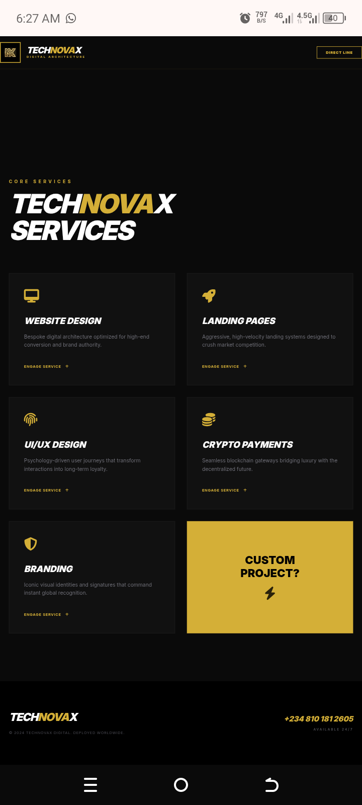
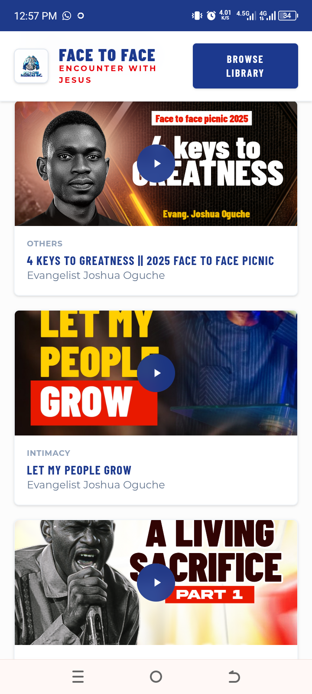
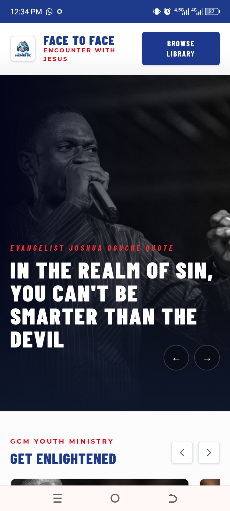
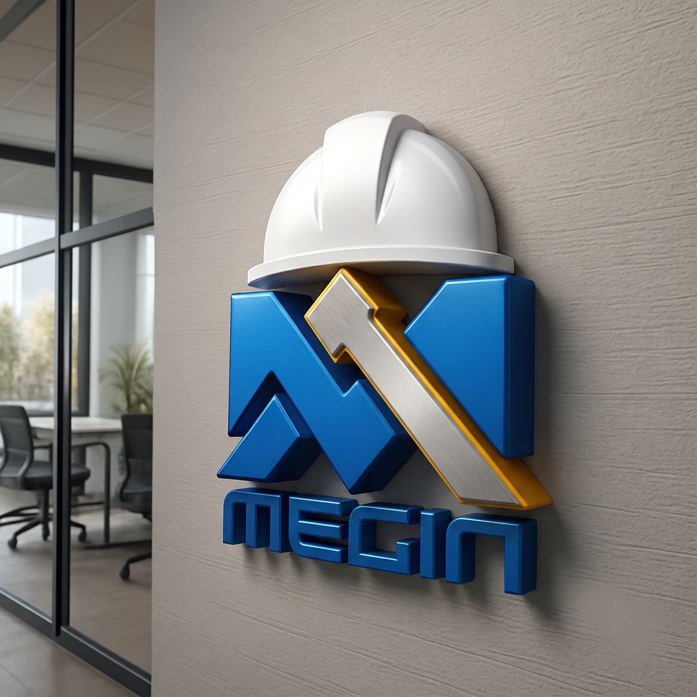
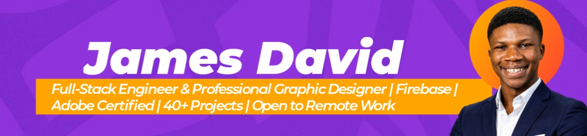

<div align="center">

# 🖥️ UI/UX Design Portfolio
### Web Design, Mockups & Interface Design by James David Ojoajogwu

[](https://davidojoajogwu.netlify.app)
[](https://linkedin.com/in/james-david-545024405)
[](mailto:jamesdavidojoajogwu@gmail.com)

</div>

---

## 📖 About This Portfolio

A curated showcase of UI/UX and web interface design work — spanning high-fidelity
mockups, portfolio layouts, and landing page designs. Each project begins with
intentional UX thinking and ends with pixel-perfect visual execution, designed
to be handed off directly to development.

---

## 🌐 Web Designs

> Full-page web interface designs built for real-world deployment.

<table>
  <tr>
    <td align="center"><br/><b>Web Design — 01</b></td>
    <td align="center"><br/><b>Web Design — 02</b></td>
  </tr>
  <tr>
    <td align="center"><br/><b>Web Design — 03</b></td>
    <td align="center"></td>
  </tr>
</table>

---

## 📱 Mockup Designs

> Device and context mockups showcasing designs in real-world environments.

<table>
  <tr>
    <td align="center"><br/><b>Mockup — 01</b></td>
    <td align="center"></td>
  </tr>
</table>

---

## 🗂️ Portfolio Layout Designs

> Creative portfolio page designs built for designers, developers, and creatives.

<table>
  <tr>
    <td align="center"><br/><b>Portfolio Design — 01</b></td>
    <td align="center"></td>
  </tr>
</table>

---

## 🛠️ Tools Used


---

## 🎯 My Design Process

```
01. DISCOVER    → User research, client brief, competitor analysis
02. WIREFRAME   → Low-fidelity sketches and information architecture
03. DESIGN      → High-fidelity mockups in Adobe XD / Figma
04. PROTOTYPE   → Interactive prototype for client review
05. HANDOFF     → Developer-ready specs, assets, and style guide
06. BUILD       → Pixel-perfect HTML/CSS/JS implementation
```

---

## 💼 What I Offer

- ✅ UI/UX design for websites, landing pages, and web apps
- ✅ High-fidelity interactive prototypes (Adobe XD / Figma)
- ✅ Design-to-code handoff with clean, reusable components
- ✅ Portfolio design for creatives and professionals
- ✅ Mobile-first, responsive design systems
- ✅ Design audits and UX reviews for existing websites

---

## 👤 About the Designer

**James David Ojoajogwu** — Professional Graphic Designer & Full-Stack Engineer,
Nigeria. Adobe Certified Specialist. 40+ projects. 100% client satisfaction.

📧 [jamesdavidojoajogwu@gmail.com](mailto:jamesdavidojoajogwu@gmail.com)
🌐 [davidojoajogwu.netlify.app](https://davidojoajogwu.netlify.app)
💼 [linkedin.com/in/james-david-545024405](https://linkedin.com/in/james-david-545024405)

---

<div align="center">

*Need a stunning UI design or website mockup?*
**[Let's Talk →](mailto:jamesdavidojoajogwu@gmail.com)**

</div>
